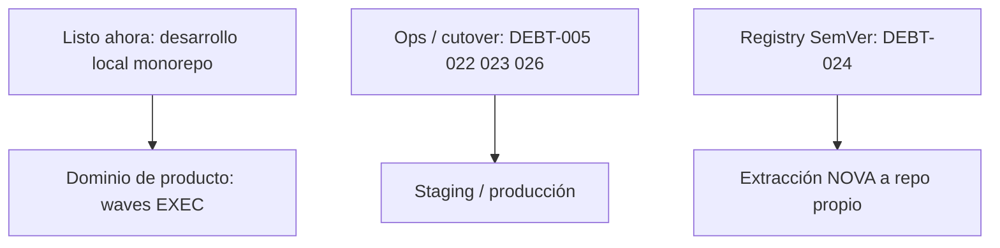

# Listo para desarrollar productos (estado en `main`)

## Veredicto

**Ya se puede desarrollar features de producto en el monorepo.** Fronteras Access/N-1, consolas/BFF por
célula, baseline vacío y CI federada están en sitio. Lo abierto es transición/ops (no tip SQL PULSO
obligatorio) y trabajo de dominio por producto.

## Ya no bloquea el desarrollo local

- Baseline de fronteras: **0 violaciones** ([`boundary-baseline.json`](boundary-baseline.json))
- Tip PULSO provider-owned avanzado (`016` attest FK; proyecciones 004–008 + contracts 009–013 gated)
- Fachada multiproducto / redirects / bridge LUMEN N-1 retirados en código
- Consolas + BFF por célula; hostname-edge como borde objetivo
- CI: canario y composición federada restaurados
  ([`federation-ci-hardening-20260719.md`](../audits/federation-ci-hardening-20260719.md))
- Validación diaria: `pnpm check` + Compose local

## Lo que sí falta — catálogo ([`debt.v1.json`](../catalogs/debt.v1.json))

| ID           | Bloquea ¿qué?                                       | Qué falta de verdad                                                                                                                                            |
| ------------ | --------------------------------------------------- | -------------------------------------------------------------------------------------------------------------------------------------------------------------- |
| **DEBT-005** | Cutover prod de FKs Access (no el greenfield local) | Paridad multi-consumer real + recibo v2 atestado; el gate en `packages/pulso-migrations/src/access-fk-contract-gate.ts` ya impide dropear con datos sin recibo |
| **DEBT-024** | Extracción física de NOVA / publish SemVer          | Credenciales de org + publish/readback registry ([`REGISTRY-PUBLISH-PATH.md`](../operations/REGISTRY-PUBLISH-PATH.md))                                         |
| **DEBT-022** | Retiro final del migrador global                    | Cutover ops + seed CEDCO por slug ([`GLOBAL-MIGRATOR-CUTOVER.md`](../operations/GLOBAL-MIGRATOR-CUTOVER.md))                                                   |
| **DEBT-023** | Limpieza edge legacy en ops                         | Confirmar en access logs que nadie depende de redirects                                                                                                        |
| **DEBT-026** | LUMEN “listo para entorno objetivo”                 | HA / edge / recovery offsite atestados fuera del repo                                                                                                          |

Detalle de cola residual: [`BOUNDARY-DEBT-BACKLOG.md`](BOUNDARY-DEBT-BACKLOG.md).

## Trabajo de producto (no es deuda de frontera)

El plan maestro ([`execution-plan.v1.json`](../catalogs/execution-plan.v1.json)) ordena el desarrollo:

1. **WAVE-00** — cadena de artefactos (ligado a DEBT-024)
2. **WAVE-01** — piloto operativo NOVA (dominio, datos, auth, reconciliación)
3. **WAVE-02** — plataforma / cutovers transicionales (005/022/023)
4. **WAVE-03** — LUMEN gobernado y recuperable (DEBT-026 + specs LUMEN)
5. **WAVE-04** — madurez funcional PULSO

Para **empezar YA** en features: trabajar en consola/BFF/servicio de la célula (NOVA, LUMEN o PULSO)
siguiendo su spec en [`docs/products/`](../products/), sin esperar registry ni cutover prod.

## Cómo priorizar el siguiente nivel

1. **Features en monorepo** — sin prerequisito de deuda; solo respetar gates (`pnpm check`, no tocar
   `009–013` sin recibo).
2. **Entorno staging usable** — activar transporte Access + backfill + recibo multi-consumer (camino
   DEBT-005 en ese entorno).
3. **Repo NOVA separado** — primero DEBT-024 (publish SemVer real).
4. **Producción** — DEBT-022/023/026 + gates de release del execution plan (`code` → `operations`).

No hay siguiente tip SQL PULSO obligado para poder codear productos; el hot path de fronteras ya está
cerrado.
