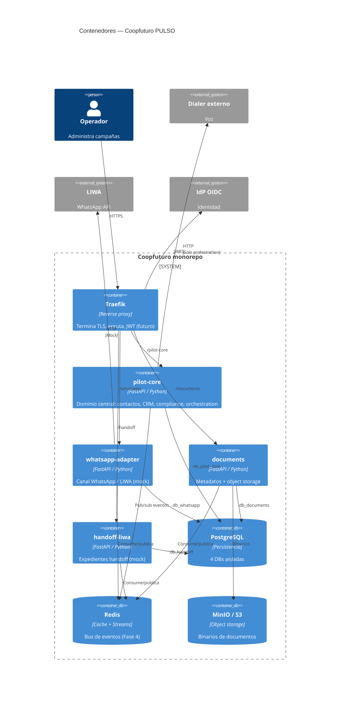

# C4 — Nivel 2: Contenedores

> **Alcance:** fundación arquitectónica. **No hay features comerciales de producto implementadas todavía.**

## Diagrama de contenedores

## Unidades desplegables

| Contenedor | Ruta | Puerto | Database |
|---|---|---|---|
| pilot-core | `/pilot-core` | 8201 | `db_pilot_core` |
| whatsapp-adapter | `/whatsapp` | 8202 | `db_whatsapp` |
| documents | `/documents` | 8203 | `db_documents` |
| handoff-liwa | `/handoff` | 8204 | `db_handoff` |

## Infraestructura compartida

| Componente | Rol |
|---|---|
| Traefik | Edge gateway; dashboard off por defecto |
| PostgreSQL | Una DB por unidad; roles `app_*` |
| Redis | Streams (bus) + cache |
| MinIO/S3 | Almacenamiento de documentos |

## Stubs legacy

`services/*` (puertos 8101–8110) — perfil `legacy-stubs` en Compose. No usar para desarrollo de dominio nuevo.

## Decisiones relacionadas

- [ADR-001](../adr/ADR-001-modular-architecture.md)
- [ADR-004](../adr/ADR-004-database-ownership.md)
- [ADR-005](../adr/ADR-005-redis-streams-transport.md)

## Ownership

Ver [service-catalog.md](service-catalog.md) y [OWNERSHIP_REQUEST.md](../OWNERSHIP_REQUEST.md).
