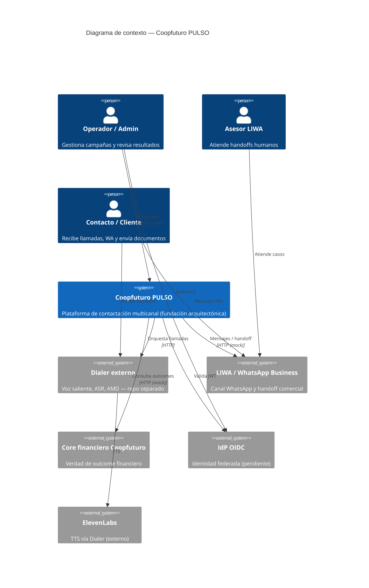

# C4 — Nivel 1: Contexto del sistema

> **Alcance:** fundación arquitectónica. **No hay features comerciales de producto implementadas todavía.**

## Descripción

Coopfuturo PULSO es la plataforma de contactación inteligente para la cooperativa. Orquesta campañas multicanal (voz, WhatsApp, documentos) con compliance, CRM y handoff humano.

## Diagrama de contexto

## Actores

| Actor | Interacción |
|---|---|
| Operador / Admin | UI futura vía gateway; JWT OIDC |
| Contacto / Cliente | Voz (Dialer), WhatsApp (LIWA), documentos |
| Asesor LIWA | Sistema externo LIWA para handoff humano |

## Sistemas externos

| Sistema | Rol | Estado |
|---|---|---|
| Dialer | Telefonía técnica | Contrato OpenAPI TBD |
| LIWA / WABA | WhatsApp | Mock hasta rotación credencial |
| Core financiero | Outcome real | Mock |
| IdP OIDC | Auth | Pendiente configuración |

## Decisiones relacionadas

- [ADR-001](../adr/ADR-001-modular-architecture.md) — Arquitectura modular
- [ADR-003](../adr/ADR-003-external-dialer.md) — Dialer externo
- [ADR-007](../adr/ADR-007-oidc-jwt-auth.md) — OIDC/JWT

## Ownership

Owners de personas: placeholders TBD en [OWNERSHIP_REQUEST.md](../OWNERSHIP_REQUEST.md).
