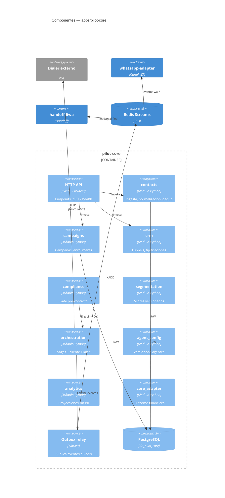

# C4 — Nivel 3: Componentes de pilot-core

> **Alcance:** fundación arquitectónica. **No hay features comerciales de producto implementadas todavía.**

## Diagrama de componentes

## Módulos y responsabilidades

| Módulo | Paquete | Escritor canónico de |
|---|---|---|
| contacts | `pilot_core.modules.contacts` | Contactos, importación |
| campaigns | `pilot_core.modules.campaigns` | Campañas, enrollments |
| crm | `pilot_core.modules.crm` | Funnels, disposiciones, leads |
| compliance | `pilot_core.modules.compliance` | Decisiones de elegibilidad |
| segmentation | `pilot_core.modules.segmentation` | Scores |
| orchestration | `pilot_core.modules.orchestration` | Attempts, llamadas |
| agent_config | `pilot_core.modules.agent_config` | Versiones de agente |
| analytics | `pilot_core.modules.analytics` | Proyecciones agregadas |
| core_adapter | `pilot_core.modules.core_adapter` | Outcomes financieros |

## Reglas de frontera

- Imports directos entre módulos prohibidos (ver [module-guide.md](module-guide.md)).
- Solo `orchestration` llama al Dialer ([ADR-003](../adr/ADR-003-external-dialer.md)).
- `analytics` no recibe PII ([ADR-011](../adr/ADR-011-pii-handling.md)).

## Estado actual del código

Módulos existen como stubs con `service.py` y health check. Sin lógica comercial productiva.

## Decisiones relacionadas

- [ADR-002](../adr/ADR-002-bounded-contexts.md)
- [ADR-006](../adr/ADR-006-outbox-inbox-idempotency.md)
