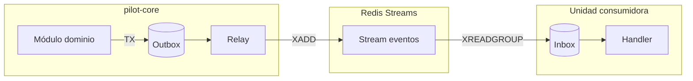

# Flujos de eventos

> **Alcance:** fundación arquitectónica. **No hay features comerciales de producto implementadas todavía.**

## Bus de eventos

- **Transporte:** Redis Streams ([ADR-005](../adr/ADR-005-redis-streams-transport.md))
- **Patrón:** Transactional Outbox + Inbox ([ADR-006](../adr/ADR-006-outbox-inbox-idempotency.md))
- **Schemas:** `contracts/events/v1/`
- **Registro:** [event-registry.md](../event-registry.md)

## Diagrama de flujo general



## Flujos principales

### Campaña → voz

```text
contact.eligibility.decided  (compliance → orchestration)
contact.attempt.requested      (orchestration)
call.requested                 (orchestration → Dialer mapping)
call.dispatched                (orchestration)
call.completed                 (webhook Dialer → orchestration)
call.disposition.recorded      (crm)
```

### Campaña → WhatsApp

```text
wa.send.requested    (pilot-core → whatsapp-adapter)
wa.message.sent        (whatsapp-adapter → pilot-core, analytics)
wa.message.delivered   (whatsapp-adapter → analytics)
wa.message.failed      (whatsapp-adapter → pilot-core)
```

### Lead calificado → handoff

```text
lead.qualified       (pilot-core/crm → handoff-liwa)
handoff.created      (handoff-liwa → pilot-core)
handoff.assigned     (handoff-liwa → analytics)
handoff.resolved     (handoff-liwa → pilot-core/crm)
```

### Supresión / opt-out

```text
preference.changed   (whatsapp-adapter o pilot-core)
contact.suppressed   (compliance → orchestration, campaigns, whatsapp-adapter)
```

## Envelope de evento (v1)

Campos planificados: `event_id`, `event_type`, `occurred_at`, `producer`, `schema_version`, `tenant_id`, `business_idempotency_key`, `data_classification`, `payload`.

## Manejo de fallos

Ver [runbooks/failed-events.md](../runbooks/failed-events.md).

## Estado actual

Schemas parciales en `contracts/`. Publicación/consumo real pendiente Fase 4. Sin tráfico productivo.
