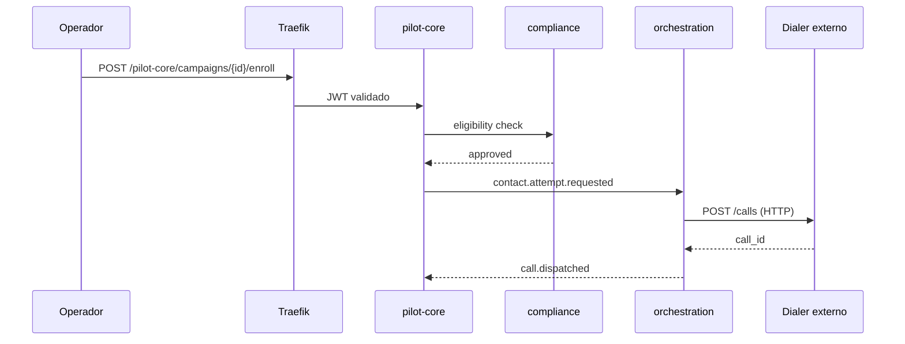
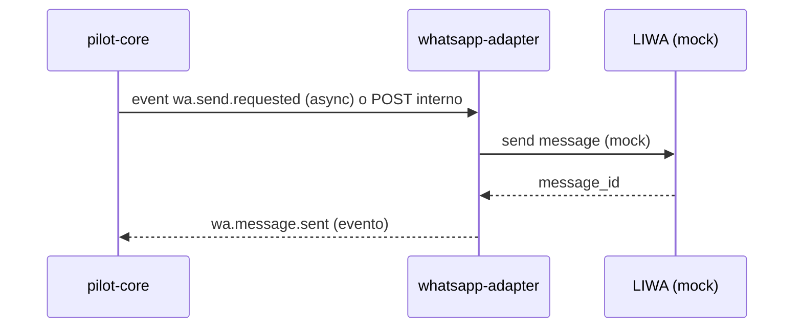
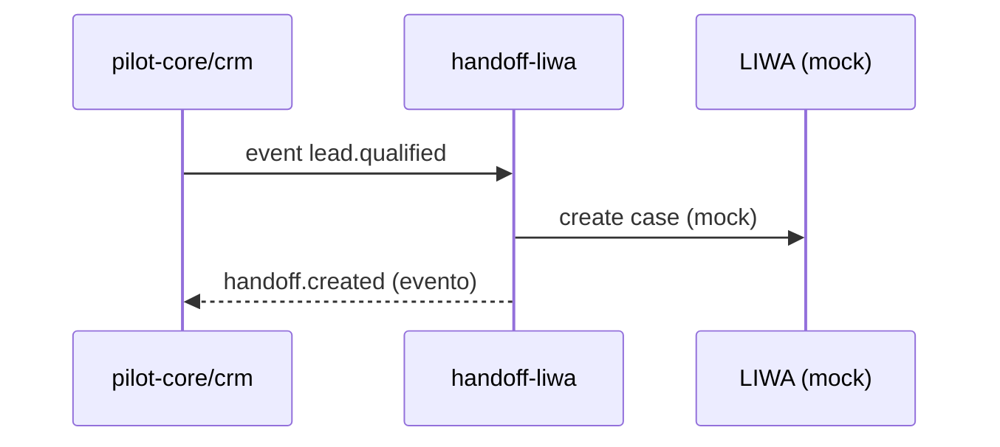

# Flujos HTTP

> **Alcance:** fundación arquitectónica. **No hay features comerciales de producto implementadas todavía.**

## Topología

```text
Cliente / UI
    │
    ▼
Traefik (edge) ── OIDC/JWT (futuro)
    │
    ├── GET  /pilot-core/health     → pilot-core
    ├── GET  /whatsapp/health       → whatsapp-adapter
    ├── GET  /documents/health      → documents
    └── GET  /handoff-liwa/health    → handoff-liwa
```

## Flujos síncronos planificados

### 1. Intento de contacto por voz



### 2. Envío WhatsApp



### 3. Handoff humano



## Auth HTTP

| Capa | Mecanismo | ADR |
|---|---|---|
| Edge → apps | JWT OIDC | [ADR-007](../adr/ADR-007-oidc-jwt-auth.md) |
| App → app | Service token | [ADR-008](../adr/ADR-008-service-to-service-auth.md) |
| orchestration → Dialer | API token dedicado | [ADR-003](../adr/ADR-003-external-dialer.md) |

## Webhooks entrantes

| Origen | Destino | Validación |
|---|---|---|
| Dialer | pilot-core/orchestration | Token/HMAC TBD |
| LIWA/WABA | whatsapp-adapter | Firma proveedor TBD |

## Trust boundaries

Ver [trust-boundaries.md](trust-boundaries.md).

## Estado actual

Solo endpoints `/health` implementados. Flujos anteriores son diseño target.
