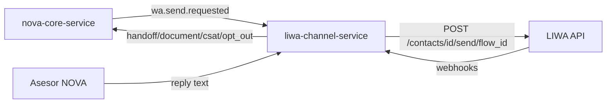

# LIWA discovery (NOVA)

LIWA es el proveedor WhatsApp usado por NOVA como **bot de flujos** y **bandeja humana**
para asesores por sede.

Swagger: [https://chat.liwa.co/api/swagger/](https://chat.liwa.co/api/swagger/)  
Base URL real: `https://chat.liwa.co/api`  
Auth: header `X-ACCESS-TOKEN` (no Bearer).

## Inventario verificado (GET live)

Cuenta descubierta con el token de integración:

| Campo | Valor |
|---|---|
| `page_id` / `LIWA_ACCOUNT_ID` | `1656233` |
| Nombre | Coopfuturo 2026 Cta Comercial |
| Activa | sí |

### Flows relevantes (`GET /accounts/flows`)

| Nombre | Flow ID | Uso en NOVA |
|---|---|---|
| Renovaciones | `1782399915832` | `LIWA_DEFAULT_FLOW_ID` (producto renovación) |
| RENOVACION_FLOR_25062026 | `1782486171458` | `LIWA_FLOW_ID_B` (A/B / Floridablanca) |

También existen flujos AccesoDirecto_AgBucaramanga, Bienvenida, etc.  
**No hay un flow llamado "reactivacion"** en la cuenta; hasta que exista, renovación usa `1782399915832`.

### Tags de agencia (`GET /accounts/tags`)

Coinciden con `novaAgencyTagByCode` en `packages/contracts/src/nova.ts`:

`AG_BARRANQUILLA`, `AG_BUCARAMANGA`, `AG_CUCUTA`, `AG_FLORIDABLANCA`, `AG_PIEDECUESTA`,
`AG_SAN GIL`, `AG_BARRANCABERMEJA`, `AG_VALLEDUPAR`, `AG_VILLAVICENCIO`.

Extras de campaña: `RENOVACION_*` por sede, `RENOVACION_VIP`.

### Teams (`GET /accounts/teams`)

Los mismos 9 nombres `AG_*` como teams (+ "CAROLINA REDMIA").

### Custom fields

Cedula, Telefono, Zona vivienda (además de Email / Phone Number de sistema).

## Modelo operativo



### Paths del adaptador Hyperion

| Operación | Endpoint real |
|---|---|
| Cuenta | `GET /accounts/me` |
| Tags | `GET\|POST /accounts/tags` |
| Aplicar tag | `POST /contacts/{id}/tags/{tag_id}` |
| Flows | `GET /accounts/flows` |
| Teams | `GET /accounts/teams` |
| Ensure contact | `POST /contacts` |
| Enviar flow | `POST /contacts/{id}/send/{flow_id}` |
| Texto (ventana 24h) | `POST /contacts/{id}/send/text` |
| Handoff a sede | **aplicar tag `AG_*`** (no existe `/handoff` en Swagger) |

### Bot de flujos

- Tras una llamada de voz exitosa, NOVA puede solicitar un flujo LIWA (`mode=flow`).
- Cold outbound siempre usa flow; texto libre requiere sesión WhatsApp 24h (`LIWA_FORCE_TEXT` solo para tests).

### Bandeja humana (inbox)

- Cuando el flujo deriva a asesor (`handoff_requested` webhook), NOVA crea un handoff por `agency_code`.
- El ruteo en LIWA se apoya en tags `AG_*` aplicados al contacto.
- Respuestas humanas: `POST /v1/tenants/:tenantId/liwa/conversations/:id/reply` (ventana 24h).

## Webhooks normalizados

Los webhooks **no se listan ni configuran por API** (ausentes en Swagger). Se configuran en la UI LIWA:
**Herramientas → Webhooks**, con URL pública HTTPS de Hyperion y header `X-LIWA-WEBHOOK-SECRET`.

`liwa-channel-service` valida ese secret y normaliza:

| Evento LIWA | Evento hacia NOVA |
|---|---|
| `document_received` | `document.received` |
| `prequal_completed` | `wa.prequal.completed` / CRM interesado |
| `handoff_requested` | `handoff.requested` |
| `csat` | store CSAT / outcome |
| `opt_out` | compliance suppress + CRM no_interes |

Binding de tenant: `liwa.tenant_bindings.liwa_account_id = 1656233`.

## Modos de despliegue

| Config | Comportamiento |
|---|---|
| Token ausente (local/ci) | `UnconfiguredLiwaClient` — el servicio arranca; las ops fallan claro |
| `LIWA_API_TOKEN` set | Cliente HTTP real contra `LIWA_BASE_URL` |

## Discovery en runtime / CLI

- Catálogo Ops: `GET /v1/liwa/catalog`
- Inventario live (solo lectura):

```bash
LIWA_API_TOKEN=... node scripts/autonomy/liwa-discover.mjs
```

## Deuda / bloqueadores

- Dominio HTTPS público estable para webhooks (infra Hyperion).
- Token LIWA no rotable → mitigar con webhook secret fuerte + mínimos privilegios + monitoreo.
- Flow de reactivación: crear en LIWA solo cuando el producto B esté confirmado.
