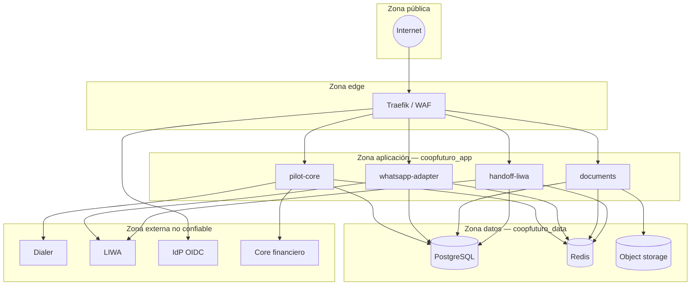

# Límites de confianza (trust boundaries)

> **Alcance:** fundación arquitectónica. **No hay features comerciales de producto implementadas todavía.**

## Diagrama de zonas

## Matriz de confianza

| Frontera | Confianza | Controles |
|---|---|---|
| Internet → Edge | Ninguna | TLS, JWT OIDC, rate limiting (futuro) |
| Edge → Apps | Baja | Validación JWT, headers sanitizados |
| App ↔ App (HTTP) | Media | Service tokens, red privada |
| App → Data | Alta | Least privilege DB roles, sin cross-DB |
| App → Externos | Ninguna | Tokens dedicados, timeouts, circuit breaker |
| Webhooks externos → App | Ninguna | HMAC/firma, IP allowlist, replay protection |

## Reglas críticas

1. **Dialer:** solo `pilot-core.orchestration` puede invocar ([ADR-003](../adr/ADR-003-external-dialer.md)).
2. **PII:** no cruza a analytics ni logs sin clasificación ([ADR-011](../adr/ADR-011-pii-handling.md)).
3. **Secretos:** nunca en repo; LIWA histórica rotada externamente ([ADR-009](../adr/ADR-009-secrets-strategy.md)).
4. **Postgres/Redis:** bind `127.0.0.1` en local; no expuestos a Internet.

## Redes Docker (local)

| Red | Miembros |
|---|---|
| `coopfuturo_edge` | Traefik, apps |
| `coopfuturo_app` | Apps |
| `coopfuturo_data` | Postgres, Redis, MinIO |

## Ownership seguridad

`@TBD-security` — confirmar en [OWNERSHIP_REQUEST.md](../OWNERSHIP_REQUEST.md).
